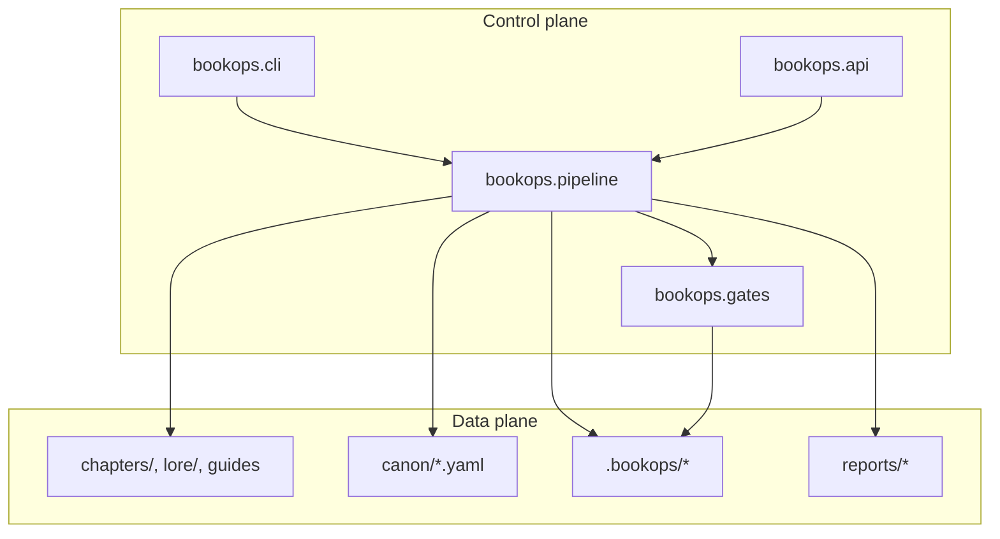

# BookOps Architecture

BookOps is a local-first agentic framework for book writing quality assurance,
continuity enforcement, lore synchronization, and editorial workflow automation.

## System layout

- **Control plane**
  - CLI command routing (`bookops.cli`)
  - HTTP API (`bookops.api`) — same operations behind `/api`
  - Pipeline orchestration (`bookops.pipeline`)
  - Gate evaluation (`bookops.gates`)
- **Data plane**
  - Source corpus (`chapters/`, `lore/`, guide docs)
  - Canon and rules: **canon snapshots** and **canon-latest** live in `.bookops/` (e.g. `.bookops/snapshots/`, `.bookops/canon-latest.json`). Project **rule and canon config** (rules, entities, timeline) live in `canon/*.yaml` (e.g. `canon/rules.yaml`).
  - Runtime state (`.bookops/*`: issues, runs, index, lore-proposals, config)
  - Reports (`reports/*`)

## Major modules

### Control-plane entry points

- `**bookops/cli.py`** — CLI command routing and argument parsing. Exposes all operations (init, analyze, pipeline, canon, issues, lore, index, template, read-model endpoints) via subcommands; delegates to pipeline, analyzers, canon, issues, lore, reports, and readmodels. Uses `--project`, `--config`, `--format`, `--output-dir`, `--strict`.
- `**bookops/api.py**` — HTTP API layer. Wraps the same operations behind FastAPI routes (e.g. `/api/run/chapter`, `/api/run/project`). Runs CLI in a locked subprocess with `BOOKOPS_PROJECT` / `BOOKOPS_OUTPUT_DIR`; returns JSON envelopes with `ok`, `exit_code`, `data`, `stderr`.
- `**bookops/gates.py**` — Gate evaluation. Given a list of issues and policy (e.g. `fail_on_unresolved_severity`), classifies blocking vs warning issues, respects waivers and resolved status, supports strict mode (warnings promoted to blocking). Returns `GateResult` (status: pass / pass_with_waivers / fail, blocking/warning issue IDs, message).

### Configuration and ingestion

- `**bookops/config.py**` — Bootstraps project config and default rule set. Defines `DEFAULT_CONFIG` (paths: `bookops_dir`, `index_dir`, `snapshots_dir`, `issues_file`, `run_history_file`, `canon_latest`; gates; project dirs and guides) and `DEFAULT_RULES` (policy precedence, gate behavior, and rule definitions with detectors such as `pov_lock`, `tense_consistency`, `timeline_anchor_check`, etc.). Loads runtime config and rules from YAML; applies templates to rules.
- `**bookops/ingest.py**` — Corpus loading and marker extraction. Loads chapters from `chapters_dir` into `ChapterDoc` (path, chapter_number, title, lines, text) and lore markdown into `LoreDoc`. Extracts time markers (Day N, absolute dates, times) and dialogue lines via regex; used by canon build and analyzers.

### Canon and analysis

- `**bookops/canon.py**` — Canon snapshot build, validate, diff. Builds a single canon payload from chapters and lore: chapter index (per-chapter markers), timeline (chapter_days, dates, times), entities (from lore). Saves timestamped snapshots and `canon-latest.json`. Validates required keys; diffs two snapshots (changed_days, entities_added/removed).
- `**bookops/analyzers.py**` — Deterministic continuity and style analyzers. Runs rule-driven detectors (e.g. timeline day sequence, tense consistency, POV lock, timeline anchors, near-verbatim repeat, motif density). Dispatches by rule `scope` (chapter vs project) and `detector`; returns lists of `Finding` with evidence (file, line, excerpt). Used by pipeline after agents; output is merged into the issue store.

### Issues and lore

- `**bookops/issues.py**` — Issue lifecycle and persistence. Stores issues in `.bookops/issues.json`. Converts findings to issues (fingerprint-based IDs), merges with existing store while preserving status (resolved, waived, in_progress). Provides update_issue_status, filter_issues (by status/severity/scope), summarize_issues (counts, top blockers). Gate evaluation reads from this store.
- `**bookops/lore.py**` — Proposal-based lore sync with manuscript-over-lore precedence. Generates “lore delta”: which chapters mention which lore entities (by name token), producing proposals for review. Optional `since_ref` limits to VCS-changed chapters. Apply/approve proposals respect policy (e.g. block if manuscript_over_lore would be violated). Writes `lore-proposals.json` under `.bookops`.

### Reports and pipeline

- `**bookops/reports.py**` — Report rendering (markdown and/or JSON). Renders analysis reports (findings list), gate report (status, blocking/warning counts), issue summary (by status/severity, top blockers). Chapter standard reports: analysis + lore delta. Project standard reports: open/resolved issues, timeline status, motif dashboard. Outputs go to `reports/` (or configured output dir).
- `**bookops/pipeline.py**` — End-to-end orchestration. **Chapter pipeline**: run agent stubs (developmental_editor → continuity_guardian → line_editor → proofreader), run chapter analysis, persist issues, render analysis + chapter standard reports, generate lore delta, evaluate gate, write decision log and append run history. **Project pipeline**: run project analysis, persist issues, render analysis + project standard reports, evaluate gate, decision log and run history. Uses config, analyzers, issues, lore, reports, gates, runlog.

### Supporting modules

- `**bookops/agents.py`** — Editorial agent stubs (story_architect, drafter, continuity_guardian, lore_curator, developmental_editor, line_editor, proofreader, release_manager). Currently returns placeholder results; intended for future LLM or tool-backed implementations.
- `**bookops/runlog.py**` — Run history and decision logs. Appends runs to `.bookops/runs.json` (run_id, scope, gate status, report_dir, decision_log path); writes per-run decision log JSON with gate, findings counts, lore delta ref. Read by readmodels for “last run” and run listing.
- `**bookops/indexing.py**` — Content index for the project. Builds a SHA256-based index of markdown files under project root (excluding `.git`, `.bookops`, etc.); used for change detection and index-status CLI.
- `**bookops/readmodels.py**` — Read-model queries for API/UI: canon graph, chapter content, rules payload, run by ID, runs list, settings payload (with patch). Consumes canon, runlog, config, ingest.
- `**bookops/vcs.py**` — VCS integration (e.g. `changed_paths_since(project_root, ref)`). Used by lore delta to scope proposals to changed chapters.
- `**bookops/models.py**` — Shared data types: `Evidence`, `Finding`, `Issue`, `GateResult`.
- `**bookops/templates.py**` — Rule templates (e.g. apply_template_to_rules); used at init and when loading rules.
- `**bookops/utils.py**` — YAML/JSON load/dump, file read/write, path helpers, `utc_now_iso`, `sha256_file`, etc.

## Execution flow

Execution is driven by `run_chapter_pipeline` and `run_project_pipeline`. Both use `RuntimeConfig` (project root, paths, output dir, rules path) and optional `strict` (gate treats warnings as blocking). Report output goes under `config.output_dir` (default `reports/`).

```mermaid
flowchart TB
  subgraph chapter["Chapter pipeline"]
    C1["Run agent stubs"]
    C2["Analyze chapter"]
    C3["Persist issues"]
    C4["Render analysis reports"]
    C5["Lore delta + chapter reports"]
    C6["Evaluate gate"]
    C7["Decision log + run history"]
    C1 --> C2 --> C3 --> C4 --> C5 --> C6 --> C7
  end
  subgraph project["Project pipeline"]
    P1["Analyze project"]
    P2["Persist issues"]
    P3["Render reports"]
    P4["Evaluate gate"]
    P5["Decision log + run history"]
    P1 --> P2 --> P3 --> P4 --> P5
  end
```

### Chapter flow

| Step | Action                           | Inputs                                                                                                                                                                | Outputs / side effects                                                                                                                                                                                                                                                        |
| ---- | -------------------------------- | --------------------------------------------------------------------------------------------------------------------------------------------------------------------- | ----------------------------------------------------------------------------------------------------------------------------------------------------------------------------------------------------------------------------------------------------------------------------- |
| 1    | **Run agent stubs**              | `config`, `chapter_id`. Agents: `developmental_editor`, `continuity_guardian`, `line_editor`, `proofreader` (in order).                                               | Stub results only (no files); used for future LLM/tool integration.                                                                                                                                                                                                           |
| 2    | **Analyze chapter**              | `config`, `chapter_id`, rules from `config.rules_path`, chapters from `config.chapters_dir`. Runs checks: tense, invariants, repetition, motifs, voice (rule-driven). | **In-memory**: `analysis` dict with `scope`, `checks`, `generated_findings` (list of Finding dicts with rule_id, severity, evidence).                                                                                                                                         |
| 3    | **Persist issues**               | `config.issues_file` (`.bookops/issues.json`), `analysis["generated_findings"]`.                                                                                      | **File**: issues merged into `.bookops/issues.json` (fingerprint IDs, status preserved for existing issues).                                                                                                                                                                  |
| 4    | **Render analysis reports**      | `chapter_report_dir` = `reports/chapter-{id}/`, scope `chapter:{id}`, `analysis`, output format (md/json/both).                                                       | **Files**: `analysis.md`, `analysis.json` (findings list).                                                                                                                                                                                                                    |
| 5    | **Lore delta + chapter reports** | `generate_lore_delta(config, chapter_id)` → proposals (chapters × lore entities by name token). Then render chapter standard reports.                                 | **Files**: `.bookops/lore-proposals.json` (when running lore delta). In report dir: `continuity.md`/`.json`, `style-audit.md`/`.json`, `lore-delta.md`/`.json`.                                                                                                               |
| 6    | **Evaluate gate**                | Issue store (filtered to scope `chapter:{id}`), rules policy `fail_on_unresolved_severity`, `strict`.                                                                 | **In-memory**: `GateResult` (status, blocking_issue_ids, warning_issue_ids, message). **Files**: `gate.md`, `gate.json` in chapter report dir.                                                                                                                                |
| 7    | **Decision log + run history**   | Gate, analysis (for counts), lore_delta (for proposal count).                                                                                                         | **Files**: `reports/chapter-{id}/decision-log.md`, `decision-log.json` (run_id, scope, gate, analysis_counts, lore_proposal_count). Run entry appended to `.bookops/runs.json` (run_id, scope, gate status, report_dir, decision_log path); history trimmed to last 200 runs. |

Chapter report directory: `{output_dir}/chapter-{chapter_id}/`.

### Project flow

| Step | Action                         | Inputs                                                                                                                                                                                | Outputs / side effects                                                                                                                                         |
| ---- | ------------------------------ | ------------------------------------------------------------------------------------------------------------------------------------------------------------------------------------- | -------------------------------------------------------------------------------------------------------------------------------------------------------------- |
| 1    | **Analyze project**            | `config`, rules, all chapters and lore from config dirs. Runs: timeline day sequence, near-verbatim repeat, lore conflicts; aggregates motif counts and timeline markers per chapter. | **In-memory**: `analysis` dict with `scope: "project"`, `generated_findings`, `metrics` (motifs per chapter, timeline_markers per chapter).                    |
| 2    | **Persist issues**             | `config.issues_file`, `analysis["generated_findings"]`.                                                                                                                               | **File**: same merge into `.bookops/issues.json`. Returns updated store (used in next steps).                                                                  |
| 3    | **Render reports**             | `project_report_dir` = `reports/project/`, analysis, full issue list from store, output format.                                                                                       | **Files**: `analysis.md`, `analysis.json`; `open-issues.md`/`.json`, `resolved-issues.md`/`.json`, `timeline-status.md`/`.json`, `motif-dashboard.md`/`.json`. |
| 4    | **Evaluate gate**              | All issues in store, rules policy, `strict`.                                                                                                                                          | **In-memory**: `GateResult`. **Files**: `reports/project/gate.md`, `gate.json`.                                                                                |
| 5    | **Decision log + run history** | Gate, analysis (no lore_delta).                                                                                                                                                       | **Files**: `reports/project/decision-log.md`, `decision-log.json`. Run entry appended to `.bookops/runs.json` (same shape as chapter).                         |

Project report directory: `{output_dir}/project/`.

### Key artifacts

- `**.bookops/issues.json`** — Single issue store; updated by both chapter and project pipelines (merge by fingerprint ID, status preserved).
- `**.bookops/runs.json**` — Append-only run history (run_id, scope, gate status, report_dir, decision_log path); last 200 runs kept.
- `**.bookops/lore-proposals.json**` — Written by chapter pipeline when generating lore delta (proposals for review).
- **Report dirs** — All report files (analysis, gate, continuity, style, lore-delta, open/resolved issues, timeline, motif, decision-log) are under `reports/chapter-{id}/` or `reports/project/`, in md and/or json per `--format`.

## Gate semantics

The gate decides whether a run **passes**, **passes with waivers**, or **fails** based on the current issue list and policy. Evaluation is done by `evaluate_gate` in `bookops/gates.py`.

### Inputs

- **`issues`** — List of issue dicts from the issue store (each with `id`, `status`, `severity`, etc.). For chapter runs, only issues whose `scope` matches the chapter are passed in; for project runs, all issues are passed in.
- **`fail_on_severities`** — Severities that count as blocking when the issue is open/in_progress. Sourced from rules: `rules["policy"]["gate"]["fail_on_unresolved_severity"]` (default `["critical"]`).
- **`strict`** — When true, any open/in_progress issue with severity `high`, `medium`, or `low` is also treated as blocking (in addition to `fail_on_severities`). Set via CLI `--strict` or API.

### Issue status handling

- **`resolved`** — Ignored; not counted as blocking or warning.
- **`waived`** — Not counted as blocking. If any issue is waived, the gate can still only be **pass_with_waivers** at best (never **pass**).
- **`open`**, **`in_progress`** — Evaluated by severity:
  - If `severity` is in `fail_on_severities` → issue is **blocking**.
  - Else if `strict` and `severity` in `{"high", "medium", "low"}` → issue is **blocking**.
  - Else → issue is **warning** (non-blocking).

### Decision order

1. If there is at least one **blocking** issue → **`fail`**.
2. Else if there is at least one **waived** issue (and no blocking) → **`pass_with_waivers`**.
3. Else → **`pass`**.

So: **pass** = no blocking issues and no waivers; **pass_with_waivers** = no blocking but at least one waiver; **fail** = one or more blocking issues.

### Result shape

`GateResult` (and its dict form in reports/API) has:

- **`status`** — `"pass"` | `"pass_with_waivers"` | `"fail"`.
- **`blocking_issue_ids`** — List of issue IDs that caused failure (if any).
- **`warning_issue_ids`** — List of issue IDs that are non-blocking (open/in_progress but below the blocking threshold, or waived).
- **`message`** — Short human-readable summary (e.g. "Blocking issues detected.", "Passed with waivers.", "Gate passed.").

### Exit codes (CLI / API)

- **`0`** — `pass`
- **`2`** — `fail`
- **`3`** — `pass_with_waivers`

These are used by the CLI and reflected in the API envelope (`exit_code`) so automation can branch on gate outcome.

## Source-of-truth policy

BookOps enforces **manuscript-over-lore precedence** in lore sync operations.
Lore writes are blocked if policy is disabled or contradictory.